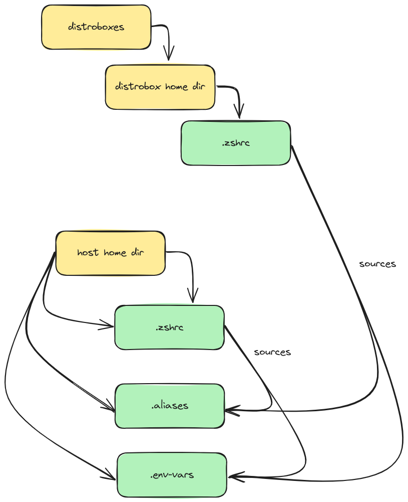

# ubuntu dev setup
config for setting up a dev environment on ubuntu with distrobox and docker

## structure

basically the structure is as follows:

have a set of distroboxes which are created via the `build-devboxes.sh` script that are used for development which have there own home dir in the `~/distrobox` directory. Then have the repo code specific for the distrobox i.e python dev will contain all python repos in the home dir of the distrobox.  

To ensure that shell config i.e env vars, aliases that needs to be shared between distroboxes the .zshrc for the ditrobox sources the `.env-vars` and `.aliases` from the host home dir. Which includes global aliases and env vars.



## setup

to setup on a new machine firstly copy the `.zshrc`, `.env-vars` and `.aliases` files to home directory and modify the files with global env vars and aliases.

Then to setup distrobox dev environments curl the `build-devboxes.sh` script and run it:

```bash
# run in env directory
curl -s https://raw.githubusercontent.com/mrllama123/dotfiles/master/dev-ubuntu/distrobox/build-devboxes.sh | bash 
```
or download the script and run it:

```bash
curl -s https://raw.githubusercontent.com/mrllama123/dotfiles/master/dev-ubuntu/distrobox/build-devboxes.sh -o build-devboxes.sh
./build-devboxes.sh
```

By default it will create the home folders in `~/distrobox` and the distroboxes will be named `devbox-<distro>` and use home dir via the `$HOME` env var this can be changed via params to the script
To find out what the params are run:

```bash
curl -s https://raw.githubusercontent.com/mrllama123/dotfiles/master/dev-ubuntu/distrobox/build-devboxes.sh | bash -s -- '--help'
```
or if downloaded:

```bash
./build-devboxes.sh --help
```

